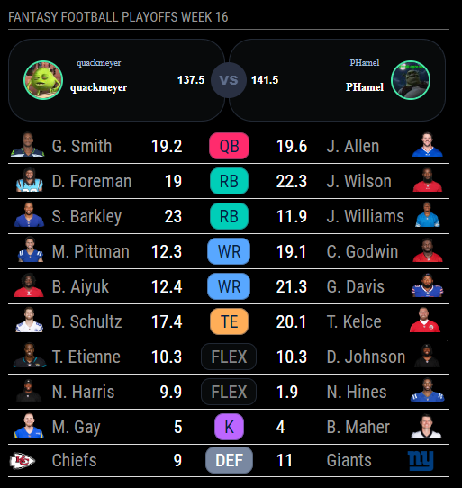
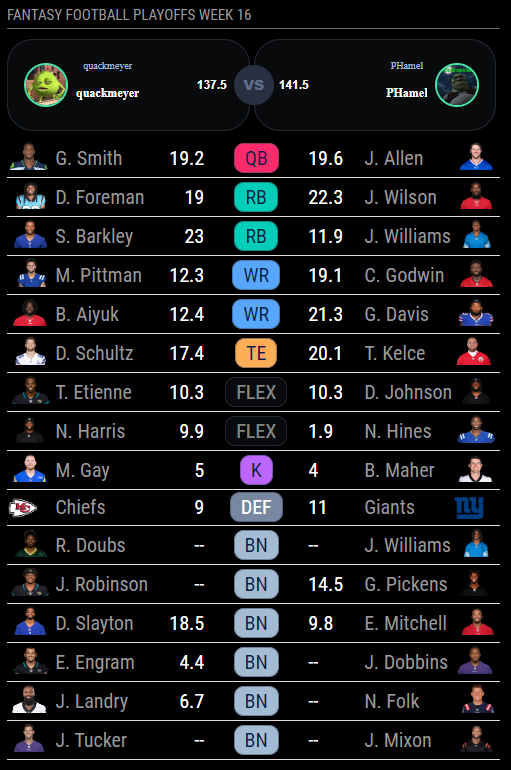

# MMM-SleeperNFL
A Sleeper NFL module that displays your weekly fantasy matchup in a simple, easy to read table. 

 

## Dependencies
* An installation of [MagicMirror<sup>2</sup>](https://github.com/MichMich/MagicMirror)
* npm
* [node-fetch](https://www.npmjs.com/package/node-fetch)

## Installation
1. Clone this repo into your `~/MagicMirror/modules` directory.
1. run `npm install` in the `~/MagicMirror/modules/MMM-SleeperNFL` directory.
1. 1. Configure your `~/MagicMirror/config/config.js`:

    ```
    {
        module: 'MMM-SleeperNFL',
        position: 'bottom_left',
        config: {
				userId: '{{Sleeper user ID}}', //required
				leagueId: '{{Sleeper league ID}}', //required
				showBench: false, //optional, default: true
                showPlayerAvatars: false, //optional, default: true
                tableSize: 'xsmall', //optional, default: 'small' ('xsmall', 'small', 'medium')
                liveInterval: 60000, //optional, default: 30000 (30 seconds)
                inactiveInterval: 300000 //optional, default: 5minutes (in milliseconds)
			}
    }
    ```

## Configuration options

 | **Option** | **Default** | **Description** |
| --- | --- | --- |
| `userId` | `required` | Your unique Sleeper user ID. Can be found at `https://api.sleeper.app/v1/user/{{YOUR_USERNAME}}` |
| `leagueId` | `required` | Your league's unique ID. Can be found in the Sleeper URL when you've logged in (`https://sleeper.com/leagues/{{leagueId}}/matchup`) or by taking your userId and querying `https://api.sleeper.app/v1/user/{{userId}}/leagues/nfl/2022`|
| `showBench` | `true` | Shows all bench players in your roster on the module (excluding Injured Reserve) |
| `showPlayerAvatars` | `true` | Displays player avatars next to their names. Can sometimes cause issues if Sleeper doesn't have an avatar for a player (usually rookies or practice squad players) |
| `tableSize` | `small` | Font size of table. Possible values: `'xsmall'`, `'small'`, `'medium'` (`'large'` and above will cause issues and likely take up the entire screen) |
| `liveInterval` | `30000` (30 seconds) | How often the player scores update when there is a live NFL game. |
| `inactiveInterval` | `300000` (5 minutes) | How often the player rosters and league details update. This reload interval will fetch things like roster changes and team/league name changes. |